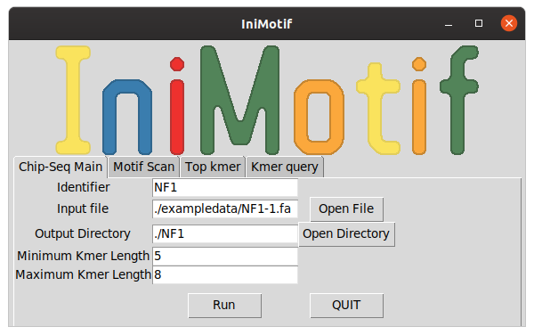
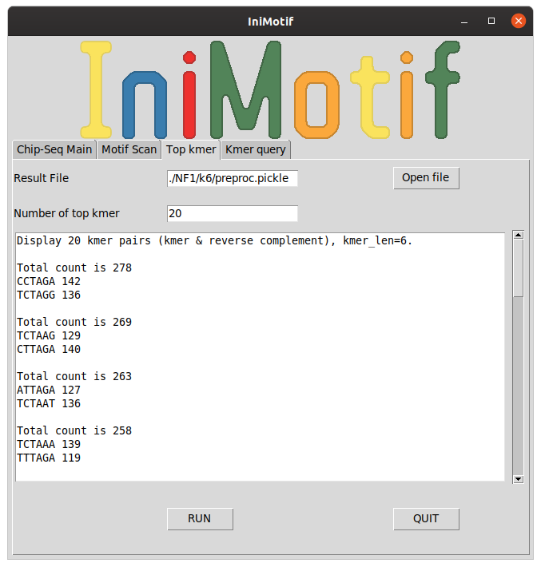
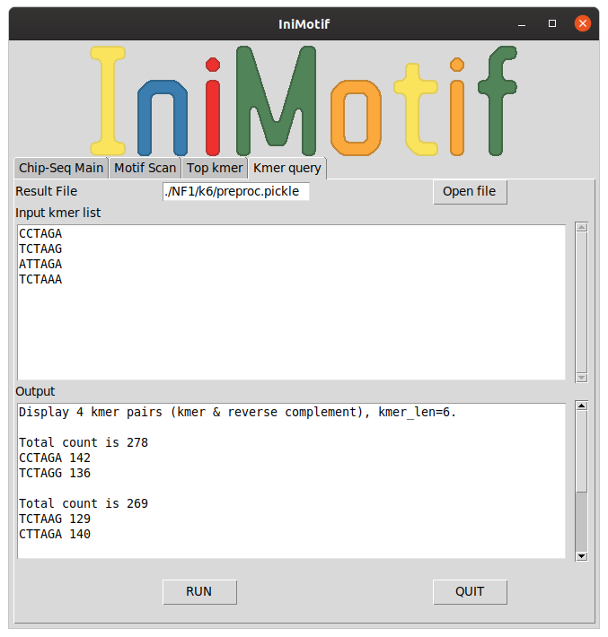
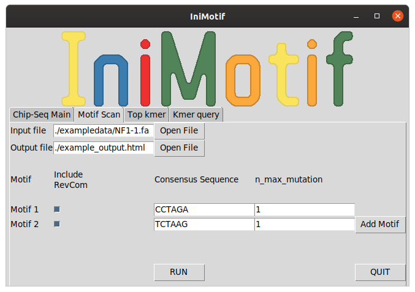

# ChIP-seq Analysis

## Motif discovery
IniMotif will scan an input sequence file for motif and provide all relevant information.

After clicking "ChIP-seq", the GUI is asking for the following information to carry out motif discovery analysis.

* Identifier: name of TF
* Input file: input sequence file, must be fasta file
* Output directory: all results will be stored in this directory
* Minimum kmer length
* Maximum kmer length

By default,

* The reverse complement of a DNA sequence is automatically considered.
* The maximum number of allowed mutations to consensus sequence for **k>=8** is 2. 
* The maximum number of allowed mutations to consensus sequence for **4<=k<=7** is 1.
* The maximum number of allowed mutations to consensus sequence for **k<4** is 0.

After click "Run", IniMotif will generate the following files in the output directory

* A file "preproc.pickle" which contains all necessary results for motif discovery.
* k#.html files, which contains motif discovery results for **k=#**

## Top kmer query

The kmer distribution figure only display the top 6 kmers with highest counts. If you want to a larger number (e.g. 10) of top kmers, then you can click the "Top kmer" tab by entering the following inputs:

* Result file: preproc.pickle
* Number of top kmers

Note that the kmers are ranked by the sum of the forward sequence and its reverse complement. Therefore you will always see a pair of kmers for each top kmer. Palindrome is only counted once. 

## Kmer query
If you are interested in the kmer counts of a known list of kmers in your input file, you could click the "kmer query" tab by entering the following inputs:

* A list of kmers. Note that the kmer length must agree with the motif discovery results.

## Motif scan
Motif scan can help us to highlight the actual locations of TF binding sites in the input sequences. This is especially useful if there exist binding sites of multiple TFs in the input sequence file.

Note that currently IniMotif only support scanning up to 2 motifs.

